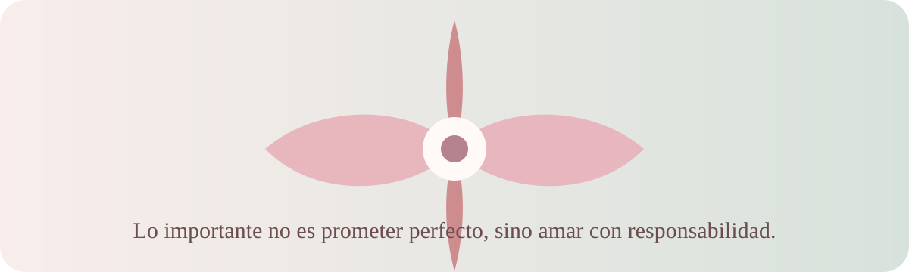

# Carta de amor y perdón

> **Para:** `RONY ALVAREZ`  
> **De:** `PEDRO CHURUNEL`  
> **Fecha:** `19/05/2026`

---

## Antes de leer

Esta carta nace desde el cariño, pero también desde la responsabilidad. No busca presionar, justificar ni borrar lo que pasó. Busca expresar con honestidad lo que siento, reconocer mis errores y pedir perdón de una forma sincera.

## Carta

Querida/o **RONY**:

Hoy quiero escribirte con el corazón tranquilo, pero también con la humildad de reconocer que no todo lo hice bien. He pensado mucho en lo que pasó, en mis palabras, en mis actitudes y en la manera en que pude haberte hecho sentir. Por eso, antes de cualquier otra cosa, quiero pedirte perdón.

Perdón por las veces en las que no supe escucharte como merecías. Perdón si mis acciones te lastimaron, si mis palabras fueron duras o si mi silencio te hizo sentir que no me importabas. La verdad es que sí me importas, más de lo que quizá supe demostrar en ese momento.

No quiero justificarme ni hacerte sentir que tienes que olvidar rápido. Entiendo que el perdón no se exige, se gana con paciencia, con cambios reales y con respeto por lo que la otra persona siente. Por eso, esta carta no es para presionarte; es para hablarte desde lo más sincero de mí.

Te amo, y ese amor me hace querer ser mejor. No perfecto, porque nadie lo es, pero sí alguien más consciente, más cuidadoso y más dispuesto a cuidar lo que tenemos. Me duele saber que pude fallarte, pero también me nace la esperanza de poder reparar, poco a poco, aquello que se dañó.

Quiero que sepas que valoro tu forma de ser, tu compañía, tus detalles y todo lo bonito que has significado para mí. A veces uno se da cuenta del valor de alguien cuando el corazón se queda pensando en todo lo que no dijo bien, en todo lo que pudo haber cuidado más y en todo lo que todavía quisiera construir.

Si me das la oportunidad de demostrarlo, quiero hacerlo con hechos. Quiero aprender a comunicarme mejor, a escuchar sin interrumpir, a reconocer cuando me equivoco y a no repetir aquello que te lastimó. No quiero prometer palabras bonitas solamente; quiero que mis acciones hablen con más fuerza que esta carta.

También quiero decirte que respeto tus tiempos. Si necesitas espacio, lo entiendo. Si necesitas hablar, aquí estaré con disposición de escucharte. Y si todavía te duele, no voy a minimizarlo. Tus sentimientos son importantes para mí.

Gracias por lo que has sido en mi vida. Gracias por los momentos lindos, por tu paciencia, por tu cariño y por todo lo que compartimos. Ojalá esta carta pueda llegar a tu corazón como una muestra honesta de amor, arrepentimiento y deseo de hacer las cosas mejor.

Con cariño sincero,

**PEDRO**

## Lo que quiero demostrar con hechos

- Escucharte con más atención y sin ponerme a la defensiva.
- Reconocer mis errores sin intentar justificarlos.
- Ser más cuidadoso/a con mis palabras y actitudes.
- Respetar tus tiempos, tus emociones y tus límites.
- Cuidar nuestro vínculo desde la paciencia, la honestidad y el cariño.

## Cierre breve para enviar por mensaje

Si deseas acompañar esta carta con un mensaje corto, puedes usar este texto:

> Hola, **RONY**. Te escribí esta carta porque quería expresarte lo que siento de una forma más tranquila y sincera. No quiero presionarte ni incomodarte, solo pedirte perdón y decirte que me importas mucho. Gracias por tomarte el tiempo de leerla.

---

### Nota para personalizar

Puedes reemplazar los textos entre corchetes, agregar una fecha especial, mencionar un recuerdo bonito o incluir una promesa concreta que sí puedas cumplir. Lo más importante es que la carta se sienta honesta y respetuosa.
